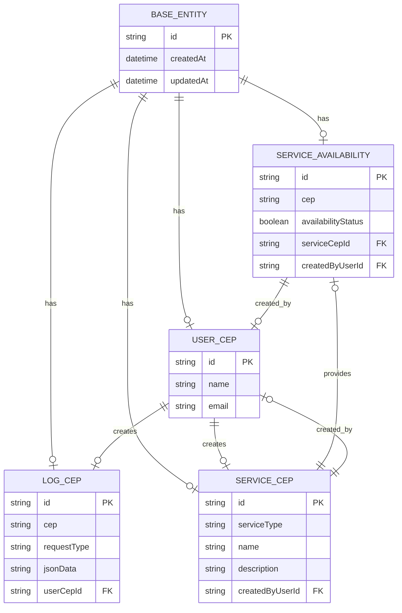

# ConsultEP

A aplicação tem o objetivo de gerenciar consultas de CEP e serviços associados, seguindo os princípios do SOLID. Contendo registros de logs, disponibilidade de serviços e geração de relatórios.

# Estrutura de pacotes

```java
com.luizromao.consultep
├── 📱 application
│   ├── usecase         # Casos de uso da aplicação
│   │   ├── 
│   │   └── 
│   └── dto            # Objetos de transferência de dados
│   │   ├── 
│   │   └── 
│		└── service        # Regras de negócio - orquestração dos use cases
│   │   ├──
│   │   └── 
├── 🏛️ domain
│   ├── model          # Entidades e objetos de domínio
│   │   ├── 
│   │   └── 
│   ├── repository     # Interfaces dos repositórios
│   │   ├── 
│   │   └── 
├── ⚙️ infrastructure
│   ├── repository     # Implementação dos repositórios
│   │   ├── 
│   │   └── 
│   ├── adapter        # Adaptadores para serviços externos
│   │   ├── 
│   │   └── 
│   └── config         # Configurações
│       ├── 
│       └── 
└── 🖥️ presentation
    ├── controller     # Controladores da API
    │   ├── 
    │   └── 
    └── exception      # Tratamento de exceções
        ├── 
        └── 
```

# Docker

A aplicação utiliza Docker para configurar as imagens do Mockoon e MySQL. Para realizar a configuração local, siga estas etapas: 

- Acessar a pasta ./docker
- Executar o comando `docker-compose up --build`

# Fluxo da Aplicação

Relacionamento das Entidades



## 📋 User Cep

Este componente gerencia os usuários do sistema. Cada usuário tem nome, e-mail e pode acessar diferentes serviços de consulta de CEP.

- 🔑 Dados principais
    - `name` → Nome completo
    - `email` → Endereço de e-mail
- 🎯 Para que serve?
    - Guardar informações dos usuários
    - Registrar histórico de consultas

---

## 📝 Log Cep

Registra todo histórico de buscas de CEP, guardando quem pesquisou, quando e que tipo de informação foi solicitada.

- 🔑 Dados principais
    - `cep` → CEP pesquisado
    - `requestType` → Tipo da busca
    - `user` → Quem fez a consulta
    - `requestTime` → Quando aconteceu
    - jsonData → Informações da requisição em JSON
- 🎯 Para que serve?
    - Manter histórico completo
    - Facilitar consultas posteriores

---

## 🔍 Service Cep

Cuida dos diferentes serviços oferecidos em cada região, como saúde, educação e transporte. Controla quem pode acessar cada serviço.

- 🔑 Dados principais
    - `serviceType` → Categoria (ex: Transporte)
    - `name` → Nome do serviço
    - `description` → Detalhes
    - `serviceAvailabilities`→ Armazenar e gerenciar informações sobre os serviços nos CEPs. Permitindo verificar se um serviço está acessível em um determinado CEP
    - `createdBy` → Informar o usuário que criou o serviço
- 🎯 Para que serve?
    - Organizar serviços disponíveis
    - Controlar acesso
    - Gerenciar por região

---

## 📍 Service Availability

Mostra quais serviços funcionam em cada CEP, tornando fácil saber o que está disponível em cada região.

- 🔑 Dados principais
    - `cep` → Região atendida
    - `serviceCep` → Tipo de serviço
    - `availabilityStatus` → Disponível ou não
    - `createdBy` → Informar o usuário que criou o serviço
- 🎯 Para que serve?
    - Mostrar serviços por região
    - Informar disponibilidade

# Fluxo Operacional

## 1. Registro de Usuários

- Processo simples de cadastro com nome e e-mail
- Dados persistidos na tabela `user_cep`

## 2. Registro de Serviços

- Cadastro dos serviços que os ceps poderão ser associados.
- Dados persistidos na tabela `service_cep`

## 3. Registro de Serviços Disponíveis no CEP

- Associnar os serviços que irão conter nos ceps
- Dados persistidos na tabela `service_availability_cep`
- Possibilidade de resgatar informações completa do CEP através da api externa (Mockoon).

## 4. Sistema de Logs

- A cada ação na aplicação será registrado os logs.
- Dados persistidos na tabela `log_cep`

## 5. Gerar Relatórios

- Gerar Relatórios csv dos Serviços Disponíveis
- Gerar Relatórios csv dos Logs
